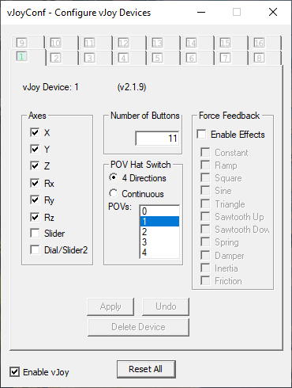
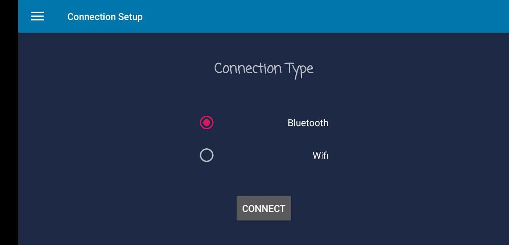
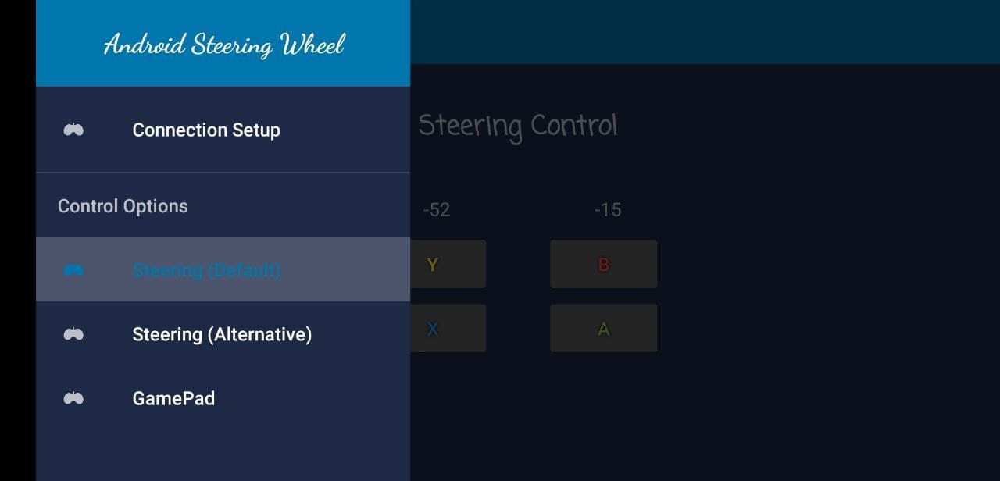
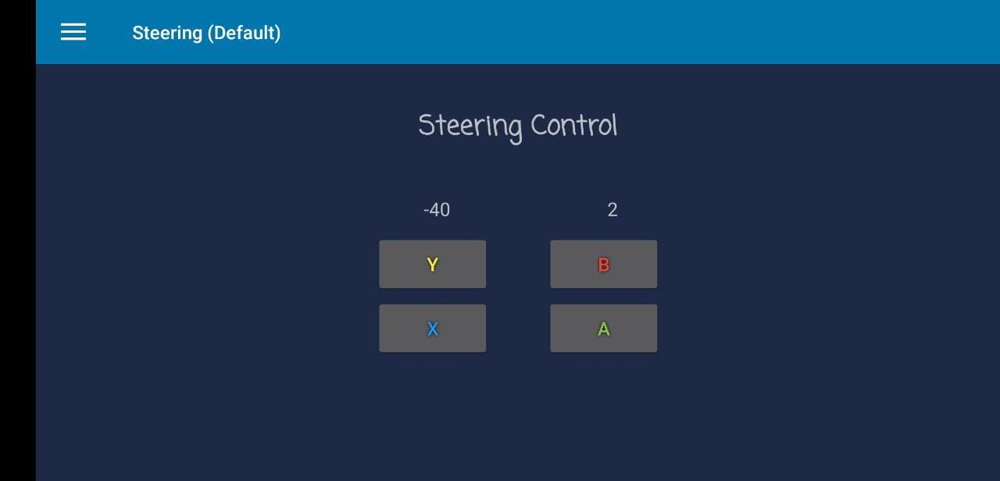
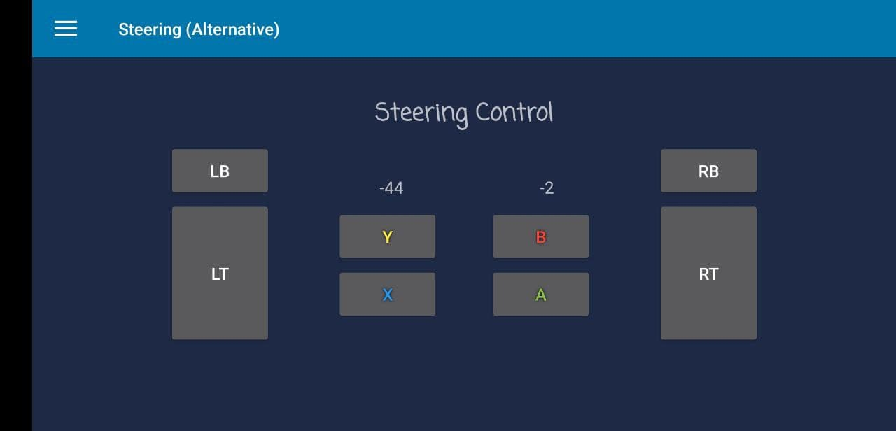
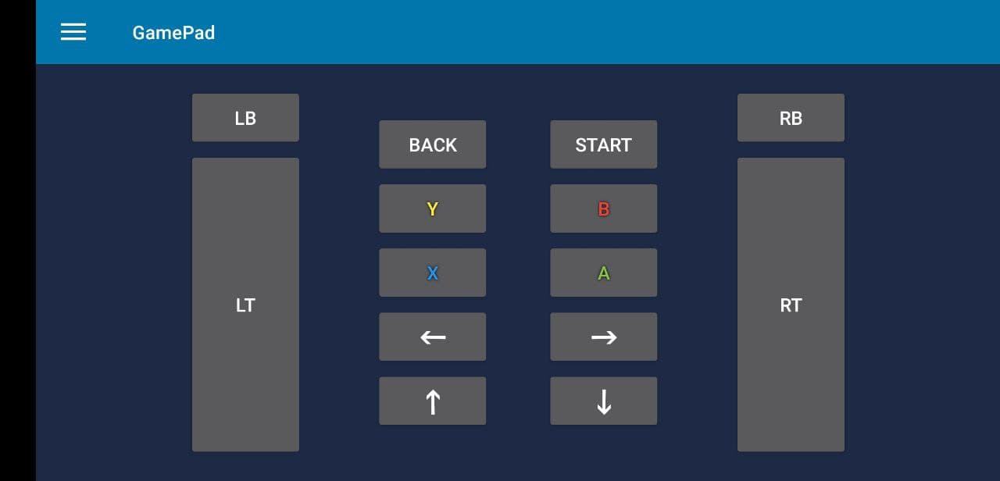
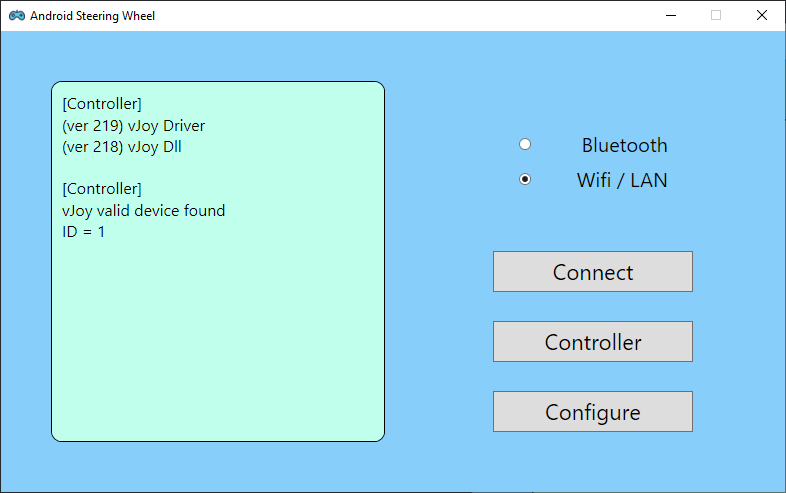
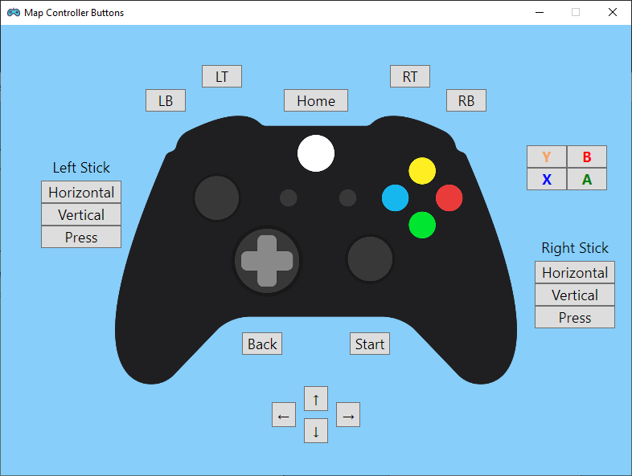

# Android Steering Wheel  

Use your Android phone as a steering wheel for Windows PC racing games  
Also a potential Xbox controller emulator  

------

### Requirements  
* Android mobile phone with bluetooth (or Wifi)  
* Windows PC with bluetooth (or Wifi Hotspot)  
* If bluetooth, phone and PC should be paired once  
* If Wifi, phone should connect to PC's mobile hotspot  
* vJoy driver installed on PC  

------

### How to Use

* __vJoy Driver__  
  1. Make sure no physical controller is attached  
  2. Download `vJoySetup.exe` from [vJoy sourceforge](https://sourceforge.net/projects/vjoystick/files/Beta%202.x/2.1.8.39-270518/) and install (Recommended to check all 4 programs)  
  3. Make sure no other program is capturing controller (e.g. Steam)  
  4. Launch `Configure vJoy` and configure the device as following:  
     

* __Android App__  
  1. After installing apk on Android phone, tap upper left corner to see all options  
  2. Connection modes:  
     1. Bluetooth requires the phone to enable bluetooth and has already paired with  target PC at least once  
     2. Wifi requires the phone to connect to the `Mobile Hotspot` of Windows PC (Or  at least in the same local network)  
  3. Control options:  
     1. `Default`: phone motion controls both acceleration and steering  
        Two changing numbers [left indicates horizontal angle (`Roll`), right  indicates vertical angle (`Pitch`)]  
        See [Android README](Android/README.md) for more information  
     2. `Alternative`: phone motion only control steering  
        Acceleration is controlled by pressing `LT` / `RT`  
        Used if default mode is too hard to control  
     3. `GamePad`: no steering is enabled, but has more buttons  
        Used to control the rest of a game (such as menu, car view, etc.)  

* __Windows App__  
  1. Install Windows application  
  2. Minimizing the app will hide app to system tray (with a notification)  
  3. Left textbox contains all essential program notifications  
  4. Be sure to check information in textbox that vJoy controller is initialized  correctly and valid device is found  
  5. To connect to phone:  
     1. Select correct connection mode  
     2. Tap `Connect` button  
     3. Server will start listening  
     4. Tap `Listening` will stop server  
     5. If connected, tap `Connected` will disconnect device and stop server  
  6. `Configure` button leads to the configuration page  
     It is used to configure buttons and stick axis in a game or steam when vJoy  controller is not recognized or has wrong settings  

------

### Releases  

Pre-built installers can be found [here](https://github.com/teamclouday/AndroidSteering/releases)  

------

### Game Demos

* [Assetto Corsa 1](https://www.bilibili.com/video/BV1XJ411C7R9) (version [1.0.0.6](https://github.com/teamclouday/AndroidSteering/releases/tag/1.0.0.6))  
* [Assetto Corsa 2](https://www.bilibili.com/video/BV1Ee411s7Zr) (version [1.1.0.4](https://github.com/teamclouday/AndroidSteering/releases/tag/1.1.0.4))  

------

### Future Plans  
* Try other sigmoid-shape functions to improve motion control (right now using `SmoothStep`)  

------

### Screenshots  

__Android Side__ (Dark Mode)  

__Windows Side__  

