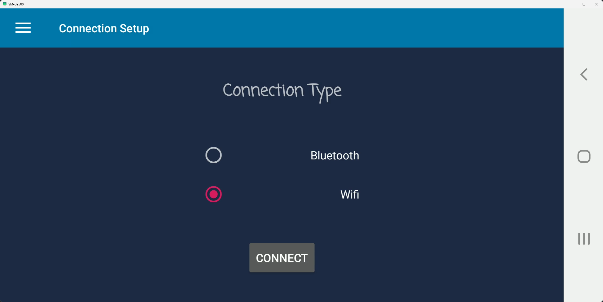
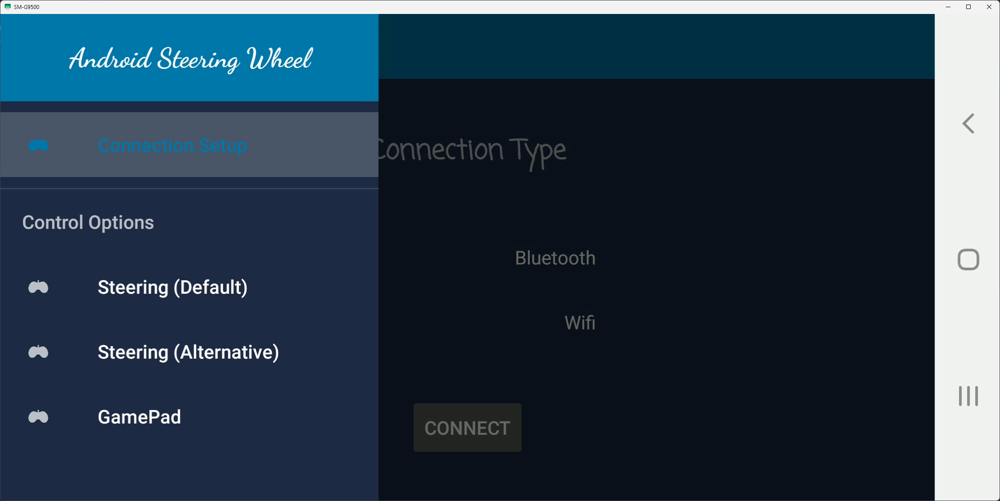
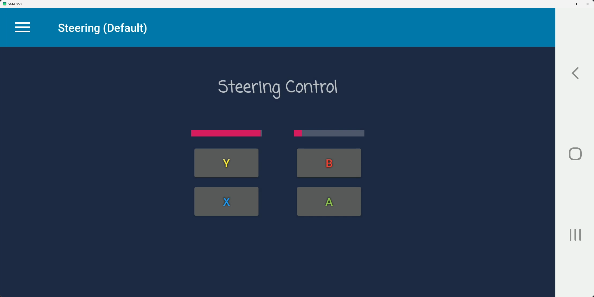
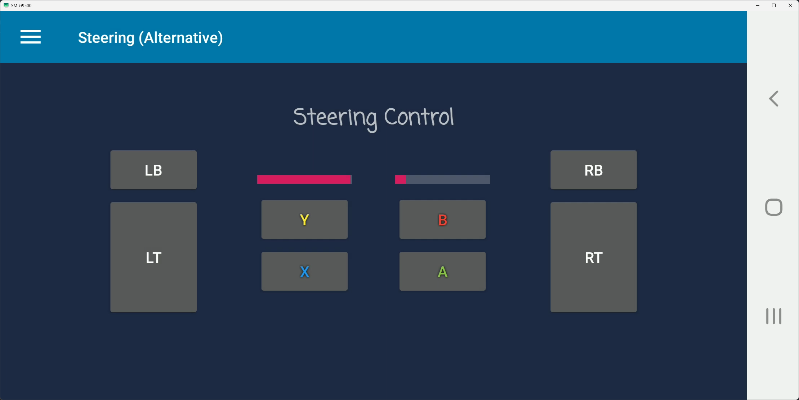
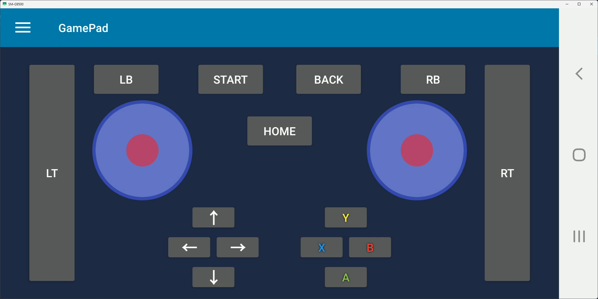
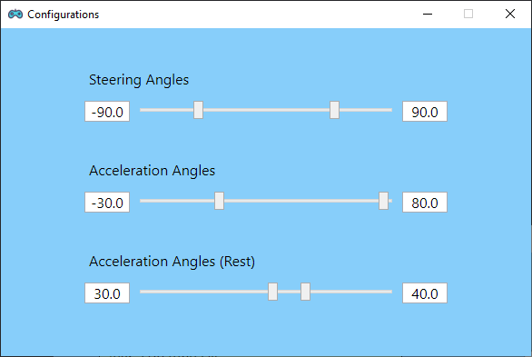

# Android Steering Wheel  

Use your Android phone as a steering wheel for Windows PC racing games  
Also a potential Xbox controller emulator  

------

### Requirements  
* Android mobile phone with bluetooth (or Wifi)  
* Windows PC with bluetooth (or Wifi/LAN)  
* If bluetooth, phone and PC should be paired once  
* If Wifi, phone should be under same network as PC (e.g. connect to same router)
* vJoy driver installed on PC  

------

### How to Use

  
vJoy Driver

1. Make sure no physical controller is attached  
2. Download `vJoySetup.exe` from [vJoy sourceforge](https://sourceforge.net/projects/vjoystick/files/Beta%202.x/2.1.8.39-270518/) and install (Recommended to check all 4 programs)  
3. Make sure no other program is capturing controller (e.g. Steam)  
4. Launch `Configure vJoy` and configure the device as following:  
   

  
Android App

  1. After installing apk on Android phone, tap upper left corner to see all options  
  2. Connection modes:  
     1. Bluetooth requires the phone to enable bluetooth and has already paired with  target PC at least once  
     2. Wifi/LAN requires the phone to connect to the the same local network as Windows PC  
        To connect, enter the same IP address displayed on PC app  
        If connection failed, check if [Windows PC firewall is blocking the app](https://pureinfotech.com/allow-apps-firewall-windows-10/)  
  3. Control options:  
     1. `Default`: phone motion controls both acceleration and steering  
        Two changing numbers [left indicates horizontal angle (`Roll`), right  indicates vertical angle (`Pitch`)]  
        See [Android README](Android/README.md) for more information  
     2. `Alternative`: phone motion only control steering  
        Acceleration is controlled by pressing `LT` / `RT`  
        Used if default mode is too hard to control  
     3. `GamePad`: no steering is enabled, but has more buttons  
        Used to control the rest of a game (such as menu, car view, etc.)  

  
Windows App

 
  1. Install Windows application  
  2. Minimizing the app will hide app to system tray (with a notification)  
  3. Left textbox contains all essential program notifications  
  4. Be sure to check information in textbox that vJoy controller is initialized  correctly and valid device is found  
  5. To connect to phone:  
     1. Select correct connection mode  
     2. Tap `Connect` button  
     3. Server will start listening  
     4. Tap `Listening` will stop server  
     5. If connected, tap `Connected` will disconnect device and stop server  
  6. `Controller` button leads to the xbox controller mapping page  
     It is used to map buttons and stick axis in a game or steam when vJoy controller is not recognized or has wrong settings
  7. `Configure` button opens the motion angle configuration window
     "Steering Angles" control the left and right limit of the steering wheel angle (in degrees)
     "Acceleration Angles" control the forward and backward limit of the phone angle for acceleration
     "Acceleration Angles (Rest)" is also for acceleration, but defines the range of angles where phone is considered at rest (no acceleration)

Finally, the first run of Windows app after installation may be slow or not responding.\
This is because the app will need to be initialized for the first time, a [well-known issue](https://stackoverflow.com/a/1308732/11397618) of ClickOnce deployment.\
In this case, close the app and open again.

------

### For Games  

By default, vJoy will use settings of xbox controller, for most modern games. Make sure to tweak in-game steering settings, because most games have been using stabilization algorithms to smooth out the steering axis input. Some may result in a lagging of steering, others may make steering extremely slow or fast.  

See [Game Steering Wheel Settings](SETTINGS.md) for more details.

  
Game Play Demos

* [Assetto Corsa](https://www.bilibili.com/video/BV1XJ411C7R9) (version [1.0.0.6](https://github.com/teamclouday/AndroidSteering/releases/tag/1.0.0.6))  
* [Assetto Corsa](https://www.bilibili.com/video/BV1Ee411s7Zr) (version [1.1.0.4](https://github.com/teamclouday/AndroidSteering/releases/tag/1.1.0.4))  
* [Forza Horizon 4](https://www.bilibili.com/video/BV1oM4y1V7NK/) (version [2.0.0](https://github.com/teamclouday/AndroidSteering/releases/tag/2.0.0))  
* [Assetto Corsa](https://www.bilibili.com/video/BV1jq4y1D7Ed/) (version [2.1.0](https://github.com/teamclouday/AndroidSteering/releases/tag/2.1.0))  

------

### Feature Plans

- [x] Motion angle restoration (stable and natural steering control)
- [x] Angle limits configuration
- [x] Steering angle range supports -180 to 180
- [x] Slider bar on phone for LT/RT controls
- [x] Memorized user settings
- [x] Connection under same network (does not have to be Wifi hotspot)
- [x] Fully implemented Xbox controller emulator

------

### Releases  

Pre-built installers can be found [here](https://github.com/teamclouday/AndroidSteering/releases)  

------

### Screenshots  

__Android Side__

__Windows Side__

